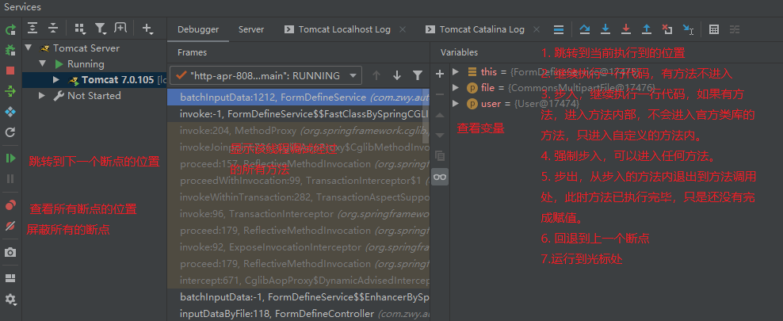

1. 电脑上的快捷键：
    * win+d：回到桌面，再次使用返回原来的窗口
    * win+e：打开资源管理器
    * win+l：锁屏
    * win+r：快速启动
        * notpad：文本文件
        * control：控制面板

2. idea快捷键
    * ctrl+alt+t：把选中的代码用指定的代码块包起来，如try-catch
    * ctrl+h：查看一个类的继承关系
    * ctrl+ ←/→：把光标移到左边/右边的空格或者标点处
    * ctrl+home/end：跳到首行/尾行
    * ctrl+shift+ ←/→：选中从光标处到左边/右边空格或标点之间的代码。与上面的一起使用可以快速选中更改
    * ctrl+F12：展示一个类中所有的方法和属性
    * shift/ctrl+F3：向上/向下寻找该变量下一次出现的位置
    * ctrl+b或按住ctrl再点击：点击变量转到变量的定义处；点击类或方法查看所有使用到该类或方法的地方
    * ctrl+alt+v：自动生成方法的返回值
    * ctrl+p：查看方法的参数信息
    * ctrl+tab：在最近文件中切换
    * shift+enter：不管光标的位置是在行中还是行尾，换到下一行
    * ctrl+alt+B：找到接口中一个方法在类中的实现
    * ctrl+U：找到实现类中的方法在接口中的位置（也可以点击方法旁边的I图标）
    * ctrl+w：光标在单词上时选中一个单词，再次点击选中扩大范围；在括号出点击选中括号内的全部内容
    * ctrl+shift+w：反选
    * ctrl+alt+L：格式化代码
    * ctrl+shift+a：查看所有的命令
    * ctrl+j：查看所有模板
    * ctrl+alt+←/→：定位到上一个/下一个浏览处
    * alt+菜单栏中选项及子选项有下划线的字母：打开相应的菜单
    * alt+侧边栏的标号：打开相应的侧边栏
    * alt+←/→：在相邻的两个打开的文件之间移动
    * alt+↑/↓：在两个方法之间移动
    * ctrl+shift+↑/↓：把一行/一个方法/一个代码块(如循环等)整体向上移动一行
    * ctrl+shift+backspace：返回上一个编辑位置
    * ctrl+'+/-'：当前方法打开/折叠
    * ctrl+shift+'+/-'：全部方法打开/折叠
    * ctrl+shift+o：删除无用的导入

3. Idea调试：

    * 代码的后面会显示变量的值，也可以alt+左键  显示变量的值。
    
    * **计算表达式**：计算某个表达式的值，如获取对象中的某个属性，判断是否为空；也可以设置变量的值。
    * **智能步入**：shift+F7，如果有多个需要步入的方法，回弹出列表提示，点击要跳入的方法步入该方法。
    * 右键点击断点可以设置断点条件，如果满足条件，该断点才生效，循环中可以直接到想要的值。
    * **View Breakpoints**：查看所有的断点信息。勾选Condition，设置断点的条件；勾选Log message to console，则会将当前断点行输出到控制台；勾选Evaluate and log，可以在执行这行代码时计算表达式的值，并将结果输出到控制台。
    * **多线程调试**：一般调试时在一个线程中，一步一步进行，但是debug时，另外的请求都无法进行。这是因为debug的默认级别是All，会阻塞其他线程，只有在当前线程走完之后才会走其他线程。可以在断点处或者View Breakpoints中选择Thead，在Frames中可以选择要调试的线程。
    * **断点回退**：回退到上一个方法调用的开始处，在IDEA里测试无法一行一行地回退或回到到上一个断点处，而是回到上一个方法。回退的方式有两种，一种是直接点击回退按钮回退到上一个方法，另一种是在调用栈方法上选择要回退的方法，右键选择Drop Frame，回退到该方法的上一个方法调用处，
    * 中断Debug：如果不想走剩余的流程，可以在方法栈中右键当前方法，选择Force Return，弹出Return Value的窗口，根据返回值选择返回的内容，或者创建新的空对象来返回。

4. Idea常用模板：

5. 获取多个文件的文件名时，可以复制这些文件，新建一个文本文档（或其他文本编辑器），粘贴到文本中。

6. 查找一个字符串经加密算法之后的值可以是使用数据库，如select md5("111")即可查出"111"对应的散列值。

7. idea中写完一个判断语句中()里的内容后直接按{键会自动生成判断体。类似的在()中写完后按;会直接跳到()外并加上;

8. Settings->Editor->General->Smart Keys中勾选Jump outside closing bracket/quote with Tab，就可以把光标从括号内部转到括号外

9. settings->Editor->ColorScheme->General->Code:Identifier under caret 和Identifier under caret(write)可以改变光标所在位置变量或方法所有使用位置的背景颜色

10. 代码左边右键 Set Bootmark 或者F11  可以设置书签，右键书签可以编辑书签信息。shift+F11显示所有的书签。

11. settings->Editor->Editor Tabs->show tabs in one row取消勾选，可以多行显示文件标签页

## Postman
1. 使用postman发送post请求并传递json数据：
    1. 设置请求头中Content-Type为Application/json。
    2. 设置body的编码方式为raw，raw是发送纯文本，不包含任何空格的编码方式。
